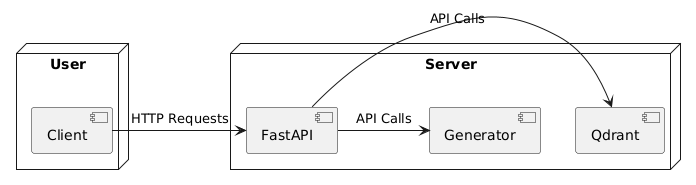

# bimser-staj-2024-2

```py
python version: 3.10
```

## Usage
```sh
# Create env
python3.10 -m venv env

# Activate env
...

# Install requirements
(env) pip install -r requirement.txt

# Run fastapi
fastapi dev main.py
```

## Project Diagrams

### Class Diagram


### Sequence Diagram


### Deployment Diagram



## Detailed Project Diagrams

### Class Diagram


### Sequence Diagram

#### Insert Document Sequence


#### Query Document Sequence


#### Generate Response Sequence


### Deployment Diagram

